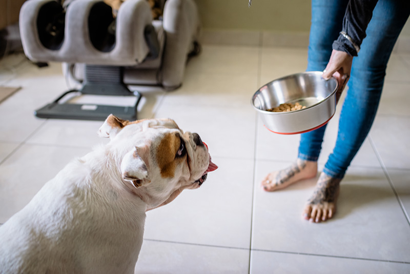

# SAM ONNX

## 所需环境

详情请见 [requirements.txt](./requirements.txt)

## 安装方法

1、首先，在anaconda中新建python3.8的环境

```
conda create -n sam python==3.8
```

2、使用pip安装requirements.txt中的依赖包

```
pip install -r requirements.txt
```

3、在使用onnxruntime的GPU进行推理时，需要安装CUDA支持，具体安装方法以及对应CUDA版本可根据[此链接](https://onnxruntime.ai/docs/execution-providers/CUDA-ExecutionProvider.html)安装。

## 模型文件下载

代码所需模型文件可以在百度网盘下载，这里由于我的电脑配置有限，只提供了vit_b的encoder模型。

链接：https://pan.baidu.com/s/1p031-5NcCROCpkaLhrhQdg?pwd=klep 
提取码：klep 
--来自百度网盘超级会员V5的分享

## 使用方法

1、激活sam环境

```
conda activate sam
```

2、跳转到工程目录

```
cd /path/of/your/project
```

3、运行inference.py

```
python .\inference.py --img .\images\dog.jpg --warmup 0 --output test.jpg
```

其中，输入的参数如下:

​	--img: 图像文件路径

​	--vit-model: vit encoder模型路径

​	--decoder-model: decoder模型路径

​	--device: 模型运行的设备，可选择cuda或cpu，默认为cuda

​	--warmup: 模型的预热轮次，默认不预热

​	--output: 输出图像位置

在运行inference.py后，首先使用vit对图像进行特征提取，当提取图像特征以后，则弹出窗口显示图像，此时，可使用鼠标左键在图像上点击，或使用鼠标右键对图像点击，绘制矩形框，此时会将采集的prompt输入decoder，进行分割。当分割完成后，点击键盘s键则可保存到输出图像位置。

## 效果

分割前



分割后


## inference

1、https://github.com/facebookresearch/segment-anything